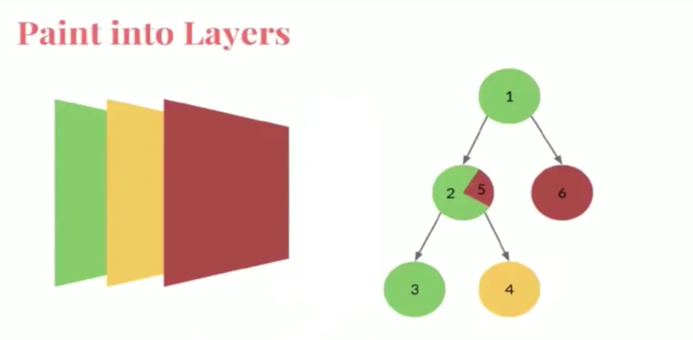

* 绘图原理与流程
* Layout 与 Paint
* relayout boundary 与 repaint boundary

## Flutter的绘图原理和UI的基本流程


1. GPU 发出 Vsync 信号
2. Dart的UI线程处理重绘逻辑
3. 生成 Layer tree 
4. 经过Compositor合成后交由Skia引擎渲染处理为GPU数据
5. GL/Vulkan发给GPU

### 2-3步，UI重绘与Layer Tree的生成
 

 * 经历了Paint方法，只是生成了layer tree
 * 需要Composite合成为一个Layer进行Rasterize光栅化处理。
    * 一般flutter的层级很多，直接把每一层传给GPU传递，效率很低，所以会先做Composite，提高效率。

光栅化之后才会给Flutter-Engine处理，这里只是Framework层面的工作，所以看不到Engine，而我们分析的也只是Framework中的一小部分。


## 回溯概念
* widget
* Element
* RenderObject

### Widget -> Element -> RenderObject


以上这三个概念也对应着三种树结构：模型树、呈现树、渲染树。

一般一个Widget被更新，那么持有该 Widget的节点的Element会被标记为dirtyElement，在下一次更新界面时，Element树的这一部分子树便会被触发performRebuild，在Element树更新完成后，便能获得RenderObject树，接下来会进入Layout和Paint的流程。

## Layout 与 Paint
### Layout
Layout的目的是要计算出每个节点所占空间的真实大小。


构建视图树的时候，节点的Constraints(约束)是自上而下的

计算layout是深度优先遍历，这是因为节点通过Constraints并不一定能够明确自己的size，有时它会依赖子节点的size，所以获取size大小是自下而上。

> [数据结构-树与树的遍历](https://onedrive.live.com/redir?resid=A4E93310558F9EA%211200&page=Edit&wd=target%28%E5%BF%AB%E9%80%9F%E7%AC%94%E8%AE%B0.one%7C2691d1ee-918a-493c-ab85-f0dcdb224c62%2F%E3%80%90%E6%95%B0%E6%8D%AE%E7%BB%93%E6%9E%84%E3%80%91%E7%90%86%E8%A7%A3%E4%BA%8C%E5%8F%89%E6%A0%91%E7%9A%84%E4%B8%89%E7%A7%8D%E9%81%8D%E5%8E%86--%E5%89%8D%E5%BA%8F%E3%80%81%E4%B8%AD%E5%BA%8F%E3%80%81%E5%90%8E%E5%BA%8F%20%2B%E5%B1%82%E5%BA%8F%EF%BC%88%E7%AE%80%E6%98%8E%E6%98%93%E6%87%82%EF%BC%89%20-%20%E7%A8%8B%E5%BA%8F%E5%91%98%E5%A4%A7%E6%9C%AC%E8%90%A5%7Cc619276d-cbce-47e5-bbe5-4ea01b539396%2F%29&wdorigin=703)

每个节点会接受到父对象的Constraints，子节点根据其来决定自己的大小，父对象会根据自己的逻辑决定子对象的位置来完成布局。

那么某个节点的size变了，整个视图树就得重新计算？如果是这样的，flutter就不存在图形的高性能了。

flutter是通过**Relayout boundary**来处理这样的问题的。

## Relayout boundary (就是自己身能确定size)
它的目的是提高flutter的绘图性能，它的作用是设置测量边界，边界内的Widget做任何改变都不会导致边界外重新计算并绘制。

当满足以下三个条件的任意一个就会触发Relayout boundary

* constraints.isTight - 最大最小宽高约束一致 - 强约束
* parentUsesSize == false 
* sizedByParent == true

### constraints.isTight 什么是isTight？
用BoxConstraints为例

它有四个属性，分别是minWidth，maxWidth，minHeight，maxHeight
* tight 如果最小约束(minWidth，minHeight)和最大约束(maxWidth，maxHeight)分别都是一样的
* loose 如果最小约束都是0.0（不管最大约束），如果最小约束和最大约束都是0.0，就同时是tightly和loose
* bounded 如果最大约束都不是infinite
* unbounded 如果最大约束都是infinite
* expanding 如果最小约束和最大约束都是infinite
所以isTight就是强约束，Widget的size已经被确定，里面的子Widget做任何变化，size都不会变。

那么从该Widget开始里面的任意子Wisget做任意变化，都不会对外有影响，就属于Relayout boundary（它会把size指向自己，这样就不会再向上递归而引起父Widget的Layout了）
### parentUsesSize == false
parentUsesSize表示父Widget是否要依赖子Widget的size，

false时，子Widget要重新布局的时候并不需要通知parent，布局的边界就是自身了。
### sizedByParent == true
sizedByParent表示当前的Widget虽然不是isTight，但是通过其他约束属性，也可以明确的知道size，

比如Expanded，并不一定需要明确的size。

看Layout的实现
```dart
void layout(Constraints constraints, { bool parentUsesSize = false }) {
    ...
    if (!parentUsesSize || sizedByParent || constraints.isTight || parent is! RenderObject) {
      relayoutBoundary = this;
    } else {
      final RenderObject parent = this.parent;
      relayoutBoundary = parent._relayoutBoundary;
    }
    ...
}
```

> 开发者可以直接使用relayout boundary吗？
> 
> 一般情况是不可以的，但是如果当你决定要自定义一个Row的时候，肯定是要使用它的。但是你可以间接的利用上面的三个条件来使你的Widget树某些地方拥有relayout boundary。
>
> 比如: LayoutBoundary();
> ```dart
> Row(children: <Widget>[
>        Expanded(
>           child: Container(
>                      height: 50.0, // add for test relayoutBoundary
>                      child: LayoutBoundary(),
>                      )),
>         Expanded(
>            child: Text('You have pushed the button this many times:'))
> ]
> ```
>

#### 测试layout触发机制
你想测试上面的三个条件成立时是否真的不会再layout，你可以自定义LayoutBoundaryDelegate来测试，

搜索关键词： `MultiChildLayoutDelegate` `CustomMultiChildLayout` 

[原文部分](https://www.jianshu.com/p/47a6503f8e65)


## Paint - 需要给GPU绘制出layer tree
Paint 的重要工作就是确定哪些Element放在同一Layer


布局size计算是自下而上的，但是paint是自上而下的。在layout之后，所有的Widget的大小、位置都已经确定，这时不需要再做遍历。


Paint也是按照深度优先的顺序，而且总是先绘制自身，再是子节点，

比如:
节点 2是一个背景色绿色的视图，在绘制完自身后，绘制子节点3和4。
当绘制完以后，Layer是按照深度优先的倒叙进行返回，类似Size的计算，而每个Layer就是一层，
最后的结果是一个Layer Tree。


2节点由于一些其他原因导致它的部分UI5与6处于了同一层，这样的结果会导致当2需要重绘的时候，与其不想相关的6实际上也会被重绘，而存在性能损耗。

所以为了提高性能，与`relayout boundary`相应的存在`repaint boundary`。

## Repaint boundary
repaint boundary会强制的使2切换到新Layer


`Repaint boundary`一般不需要开发者设置。但开发者可以手动设置，Flutter提供`RepaintBoundary`组件，你可以在你认为需要的地方，设置`Repaint boundary`。

```dart
class PaintBoundary extends StatelessWidget {
  @override
  Widget build(BuildContext context) {
    return CustomPaint(painter: CirclePainter(color: Colors.orange));
  }
}

class CirclePainter extends CustomPainter {
  final Color color;

  const CirclePainter({this.color});

  @override
  void paint(Canvas canvas, Size size) {
    print('CirclePainter paint');
    var radius = size.width / 2;
    var paint = Paint()
      ..color = color
      ..style = PaintingStyle.fill;
    canvas.drawCircle(Offset(radius, size.height), radius, paint);
  }

  @override
  bool shouldRepaint(CustomPainter oldDelegate) => false;
}
```

