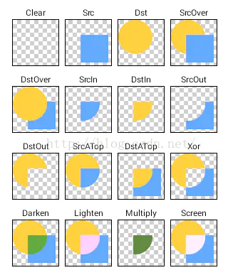
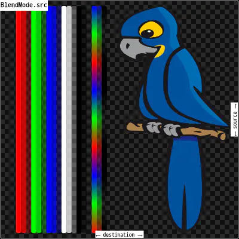
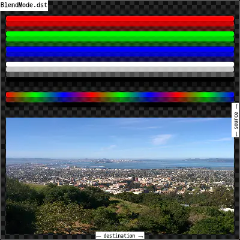

# BlendMode（图像混合模式）
Android原生有PorterDuffXferMode相似的实现：

> 理解 混合模式（Blend Mode）
>
> 虚幻引擎角度
> 
> ”混合模式“用来定义半透明度类型，一般情况下，它负责控制各种类型的半透明。半透明度由于各种原因非常难以处理，延迟渲染器（GBuffe）也给它施加了各种限制，因此使用半透明面临的困难很多，针对这些困难点产生了对应的半透明度设置，以及各种处理半透明度的方法。这也导致了它过于复杂，难以深入详细讲解。半透明度具有大量相关选项和功能，要详细讲解和理解何时应该使用哪些半透明度设置，颇有些令人望而却步。
> 
> CSS 角度
> 当层重叠时，混合模式是计算像素最终颜色值的方法，每种混合模式采用前景和背景的颜色值，执行其计算并返回最终的颜色值。最终的可见层是对混合层中的每个重叠像素执行混合模式计算的结果。

src是绘制图像，dst是底图：

|--|--|
|:---:|:---:|
| ||
| src |dst|

1. clear:清除所有内容
2. src：只显示源图像
3. srcOver：默认值。将src与dst进行组合，如果src和dst有重叠的地方，则以src内容覆盖与dst重叠的地方。
4. dstOver：与srcOver相反，This is useful when the source image should have been painted before the destination image, but could not be（摘自源码注释，翻译:当源图像应该在目标图像之前绘制，但不能绘制时，这是非常有用的。说实话，官方给出的下图不理解为什么src的鸟和dst下面的图片不显示？）
5. srcIn：只显示src和dst重合部分，且dst的重合部分只有不透明度有用。（这个图也不理解）
6. dstIn：只显示src和dst重合部分，且src的重合部分只有不透明度有用。
7. srcOut：显示src图像，但只显示src和dst的不重合部分，且重合部分只有dst是不透明的才算重合
8. dstOut：显示dst图像，但只显示src和dst的不重合部分，且重合部分只有src是不透明的才算重合
9. srcATop：将src与dst进行组合，但只组合src和dst重合部分，不重合部分显示dst
10. dstATop：将src与dst进行组合，但只组合src和dst重合部分，不重合部分显示src
11. xor：显示src和dst不重合部分，重合部分不显示
12. plus：混合src和dst，其中src的颜色透明度降低
13. modulate： 将src和dst重叠部分混合，使混合部分颜色相乘，这只能导致相同或更深的颜色(乘以白色，1.0，结果没有变化;乘以黑色，得到黑色)。当合成两个不透明的图像时，其效果类似于将屏幕上的两个透明度重叠。如果src或dst考虑透明度，可以使用[multiply]
14. screen： 将src图像和dst图像的分量的倒数相乘，并将结果的倒数相乘。反转组件意味着将完全饱和通道(不透明的白色)视为值0.0，而通常将值0.0(黑色、透明)视为值1.0。这与[modulate]混合模式本质上是相同的，但是在乘法运算之前颜色的值是倒过来的，在渲染之前结果是倒过来的。这只能导致相同或更浅的颜色(乘以黑色，1.0，结果没有变化;乘以白色，0.0，结果是白色)。同样，在alpha通道中，它只能产生更不透明的颜色。这与两个同时在同一屏幕上显示图像的投影仪有相似的效果。
15. overlay：将src图像和dst图像的组件相乘，然后调整它们以适应dst。具体来说，如果dst值更小，则将其与src值相乘，而src值更小，则将src值的倒数与dst值的倒数相乘，然后将结果相乘。反转组件意味着将完全饱和的通道(不透明的白色)视为值0.0，而通常将值0.0(黑色、透明)视为值1.0。
16. darken：通过从每个颜色通道中选择最小值来组合源图像和目标图像。输出图像的不透明度计算方法与[srcOver]相同。
17. lighten： 通过从每个颜色通道中选择最大值来组合源图像和目标图像。输出图像的不透明度计算方法与[srcOver]相同。
18. colorDodge：用src的倒数除以dst。反转组件意味着将完全饱和通道(不透明的白色)视为值0.0，而通常将值0.0(黑色、透明)视为值1.0。
19. colorBurn：用dst函数的倒数除以src函数的倒数，然后求结果的倒数。反转组件意味着将完全饱和通道(不透明的白色)视为值0.0，而通常将值0.0(黑色、透明)视为值1.0。
20. hardLight：将src图像和dst图像的组件相乘，然后对它们进行调整，使之有利于src。具体来说，如果src值更小，则将其与dst值相乘，而如果dst值更小，则将dst值的倒数与src值的倒数相乘，然后将结果相乘。反转组件意味着将完全饱和通道(不透明的白色)视为值0.0，而通常将值0.0(黑色、透明)视为值1.0。
21. softLight: 对于小于0.5的src值使用[colorDodge]，对于大于0.5的src值使用[colorBurn]。这导致了与[overlay]相似但更柔和的效果。
22. difference: 从每个通道的大值中减去小值。合成黑色没有效果;合成白色使另一幅图像的颜色相反。输出图像的不透明度计算方法与[srcOver]相同。这种影响类似[exclusion]，但更为严重。
23. exclusion:从两个图像的和中减去两个图像的乘积的两倍。合成黑色没有效果;合成白色使另一幅图像的颜色相反。输出图像的不透明度计算方法与[srcOver]相同。效果类似[difference]，但更柔和。
24. multiply:将src图像和dst图像的组件相乘，包括alpha通道。这只能导致相同或更深的颜色(乘以白色，1.0，结果没有变化;乘以黑色，得到黑色)。由于alpha通道也是相乘的，在一个图像中一个完全透明的像素(不透明度0.0)会导致输出中一个完全透明的像素。这与[dstIn]很相似，但是颜色混合了。如果src和dst都没有透明度，则可以使用[modulate]
25. hue:取src图像的色调，以及dst图像的饱和度和亮度。其效果是将dst图像与src图像着色。输出图像的不透明度计算方法与[srcOver]相同。在src图像中完全透明的区域从dst图像中获取它们的色调。
26. saturation:取src图像的饱和度，以及dst图像的色调和亮度。输出图像的不透明度计算方法与[srcOver]相同。在src图像中完全透明的区域从dst图像中获取饱和度。
27. color:取src图像的色调和饱和度，以及dst图像的亮度。其效果是将dst图像与src图像着色。输出图像的不透明度计算方法与[srcOver]相同。在src图像中完全透明的区域从dst图像中获取它们的色调和饱和度。
28. luminosity:取src图像的亮度，以及dst图像的色调和饱和度。输出图像的不透明度计算方法与[srcOver]相同。在src图像中完全透明的区域从dst图像中获取亮度

# Links
* [BlendMode（图像混合模式）](https://www.jianshu.com/p/4fb8f1a08d12)
* [css blend mode](https://developer.mozilla.org/zh-CN/docs/Web/CSS/blend-mode)