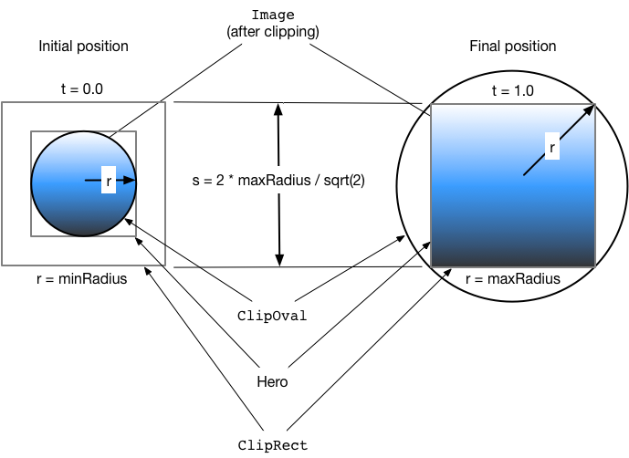

# Hero 要点
hero可以完成全部的补间动画过程。没有额外的写法。
* tag属性保证两页一致
* 位移动画，位置对了基本就对了
* 形变的动画，需要提前计算空间变化，与中心点。否则overlay中的补间动画不符合思维惯性。
    * 下图，使用ClipRect框住整体大小
    * Oval扩张、Hero扩张，才能得到想要的形变效果。

蓝色渐变（表示图片）表示剪辑形状相交的位置。在转换开始时，相交的部分是一个圆形剪辑（ClipOval）。
在转换过程中，
* `ClipOval从minRadius过渡到maxRadius，`
* `而ClipRect 保持固定大小。在转换结束时，圆形和矩形剪辑的交集产生与 hero widget大小相同的矩形。`
换句话说，在过渡结束时，图片不再被剪切。

# Flutter Hero动画
Hero指的是可以在路由(页面)之间“飞行”的widget。

* hero 从一个路由飞到另一个路由。
* hero 的形状从圆形转换为矩形，同时将其从一个路由飞到另一个路由的过程中进行动画处理。

## Hero动画的基本结构
* 在不同路由中使用两个 hero widget，但使用匹配的标签来实现动画。
* 导航器管理包含应用程序路由的栈。
* 从导航器栈中推入或弹出路由会触发动画。
* Flutter框架会计算一个补间矩形 ，用于定义在从源路由“飞行”到目标路由时 hero 的边界。在“飞行”过程中， hero 会移动到应用程序上的一个叠加层，以便它出现在两个页面之上。

1. Hero - 从源路由飞到目标路由的 widget。为源路由定义一个 hero ，为目标路由定义另一个 hero 
2. Inkwell - 指定点击 hero 时发生的情况。InkWell的onTap()方法构建新路由并将其push到导航器的栈。
3. Navigator - 导航器管理一个路由栈。从导航器栈中push或pop路由会触发动画(打开新页或返回上一页)。
4. Route - 指定一个路由或页面。除了最基本的应用之外，大多数应用都有多条路由。

# Links
* https://flutterchina.club/animations/hero-animations/
* https://medium.com/flutter-community/mastering-hero-animations-in-flutter-bc07e1bea327