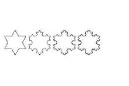
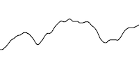
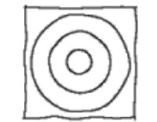
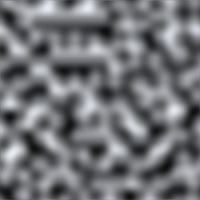
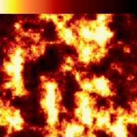
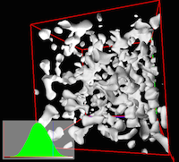
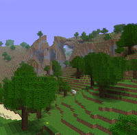

* 分形
* Perlin noise

# 分形
分形，具有以非整数维形式充填空间的形态特征。通常被定义为“一个粗糙或零碎的几何形状，可以分成数个部分，且每一部分都（至少近似地）是整体缩小后的形状”，即具有自相似的性质。分形（Fractal）一词，是芒德勃罗创造出来的，其原意具有不规则、支离破碎等意义。1973年，芒德勃罗（B.B.Mandelbrot）在法兰西学院讲课时，首次提出了分维和分形的设想。

分形作为一种数学工具，现已应用于各个领域，如应用于计算机辅助使用的各种分析软件中。

# Perlin noise
Perlin noise 就是一种非常有用强大的算法，常用于生成看似杂乱而又有序的内容。尤其特别适合用于游戏和其他视觉媒体，如电影。它的创始人Perlin也因为最先运用此技术而获得奥斯卡奖。
Perlin Noise 可以用来表现自然界中无法用简单形状来表达的物体的形态，比如火焰、烟雾、表面纹路等。

|噪音维数|原始噪音 (Grayscale)|实例||
|:---:|:---:|:---|---|
|1维|||Using noise as an offset to create handwritten lines.|
|2维|||By applying a simple gradient, a procedural fire texture can be created.|
|3维|||Perhaps the quintessential use of Perlin noise today, terrain can be created with caves and caverns using a modified Perlin Noise implementation.|

# Links
[【计算机图形】Perlin Noise 实例和理解](https://blog.csdn.net/Sengo_GWU/article/details/80153638)