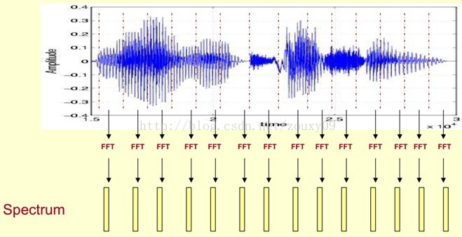
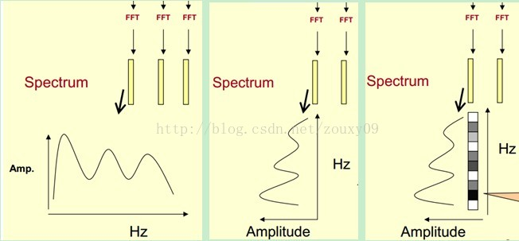
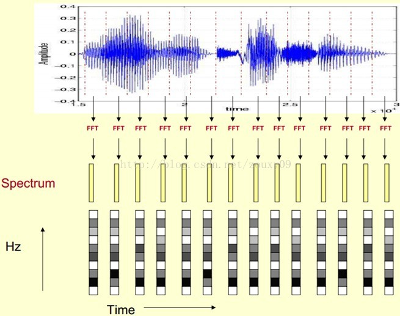

* 梅尔频率倒谱系数（MFCC）
 MFCCs（Mel Frequency Cepstral Coefficents）是一种在自动语音和说话人识别中广泛使用的特征。它是在1980年由Davis和Mermelstein搞出来的。从那时起。在语音识别领域，MFCCs在人工特征方面可谓是鹤立鸡群，一枝独秀，从未被超越啊（至于说Deep Learning的特征学习那是后话了）。

 # 一、声谱图（Spectrogram）
 ## step 1
 > spectrum 频谱

这段语音被分为很多帧，每帧语音都对应于一个频谱（通过短时FFT计算），频谱表示频率与能量的关系。

 

 实际使用中，频谱图有三种，即
 * 线性振幅谱、
 * 对数振幅谱、
 * 自功率谱（对数振幅谱中各谱线的振幅都作了对数计算，所以其纵坐标的单位是dB（分贝）。

 > 目的: 
 >
 > 是使那些振幅较低的成分相对高振幅成分得以拉高，以便观察掩盖在低幅噪声中的周期信号
---
## step 2

 

1. 我们先将其中一帧语音的频谱通过坐标表示出来，如上图左。
2. 现在我们将左边的频谱旋转90度。得到中间的图。
3. 然后把这些幅度映射到一个灰度级表示（也可以理解为将连续的幅度量化为256个量化值？），0表示黑，255表示白色。幅度值越大，相应的区域越黑。这样就得到了最右边的图。

> 那为什么要这样呢？
>
> 为的是增加时间这个维度，这样就可以显示一段语音而不是一帧语音的频谱，而且可以直观的看到静态和动态的信息。优点稍后呈上。

这样我们会得到一个随着时间变化的频谱图，这个就是描述语音信号的spectrogram声谱图。

---

# xxx
一个是梅尔频谱，一个是梅尔倒谱

输入语音信号->预加重->分针->加窗->FFT（傅里叶变换）->Mel滤波器->对数运算->DCT(离散预先变换)->MFCC

这是MFCC（梅尔倒谱）的提取过程，而梅尔频谱则是经过Mel滤波器就直接输出的一个结果

其实从mfcc（）API可以看出来，mfcc是在melspectrogram基础上得来的
# Links
https://blog.csdn.net/zkl99999/article/details/80723755

https://blog.csdn.net/qq_40703471/article/details/110142513
